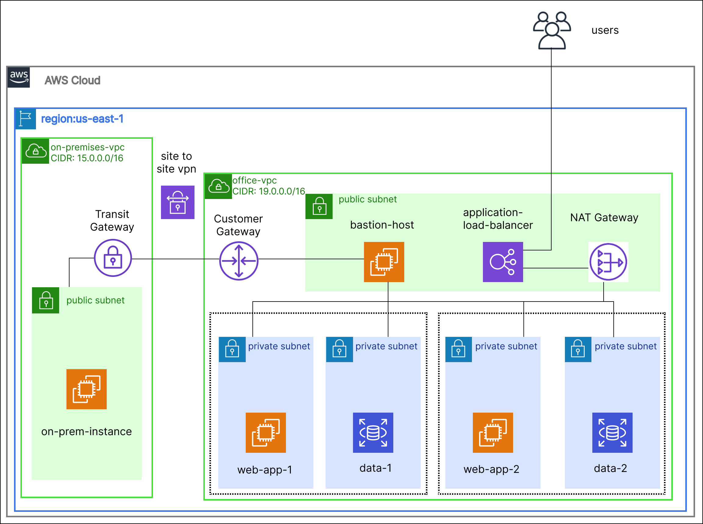

# NetMaze Explorer (Implement and manage virtual networking)

Design a hybrid networking environment where on-premises networks connect securely to AWS resources using AWS's networking capabilities, ensuring secure data transition and effective resource access controls.



- **AWS Services Used:**
    - AWS VPC
    - AWS EC2
    - AWS Subnets
    - AWS Customer Gateway
    - AWS Virtual Private Gateway
    - AWS NAT Gateway
    - AWS Security Groups (NSGs)
    - AWS Bastion
    - AWS Elastic Load Balancer
- **Steps:**

   1. AWS Virtual Network Setup:

        Provision an AWS VPC in your chosen region.
        Create multiple subnets within this VPC to segregate resources effectively (e.g., WebApp Subnet, Database Subnet, Admin Subnet).

    2. On-Premises Network Simulation:

        For the sake of this project, use another VNet to simulate your on-premises environment. This can be in another Azure region or the same region based on preference.

    3. Secure Connectivity:

        Implement AWS Customer Gateway and AWS Virtual Private Gateway to create a site-to-site VPN connection between your simulated on-premises VPC and your Office VPC.
        Verify the connection and ensure resources from one VPC can communicate with another, effectively simulating a hybrid environment.

    4. Resource Deployment & Network Access Control

        Deploy test resources (like VMs) in each subnet of your main VPC. For instance, deploy a web server VM in the WebApp Subnet, a database in the Database Subnet, etc.
        Use Security Groups (NSGs) to define inbound and outbound access rules for each subnet, ensuring that only valid traffic is allowed. For instance, only allow HTTP/HTTPS traffic to the WebApp Subnet.

    5. Secure Administrative Access:

        Implement Azure Bastion for secure and seamless RDP and SSH access to your virtual machines, ensuring you don't expose your VMs to the public internet.


    6. DNS and Load Balancing:

        Configure Azure DNS to have custom domain names for your resources.
        Implement Azure Load Balancer to distribute traffic across your VMs in the WebApp Subnet.

    7. Performance and Security Testing:

        Simulate various network scenarios to test performance, such as data transition between on-premises and Azure.
        Attempt to access resources from outside the permitted paths to validate the security configurations in place.

    8. Monitoring and Auditing:

        Enable monitoring and diagnostics on your VPN Gateway, NSGs, and other network resources to gain insights into network operations.
        Review logs and set up alerts for any suspicious activities.


## Usage

### 1. Clone the Repository

```bash
git clone https://github.com/ShrithikShahapure/netmaze-explorer.git
cd netmaze-explorer
```

### 2. Follow the steps in each folder
